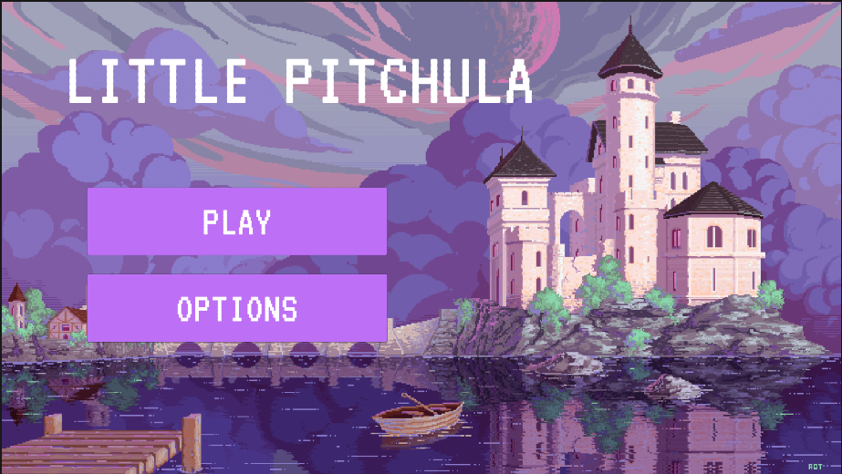
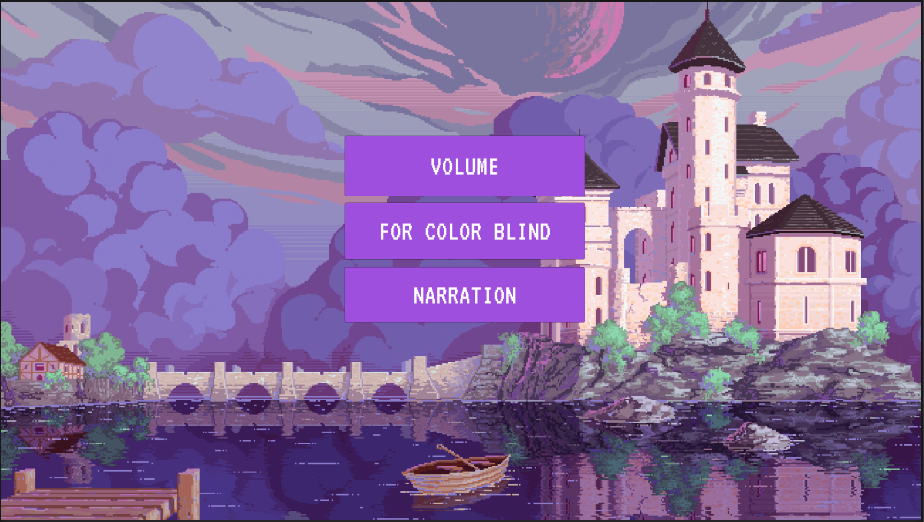

<h1 align="center">2022-303-Little Pitchula</h1>

 <h2>Índice</h2> 

* [Título e Imagem de capa](#Título-e-Imagem-de-capa)
* [Índice](#índice)
* [Descrição do Projeto](#descrição-do-projeto)
* [Status do Projeto](#status-do-Projeto)
* [Funcionalidades e Demonstração da Aplicação](#funcionalidades-e-demonstração-da-aplicação)
* [Acesso ao Projeto](#acesso-ao-projeto)
* [Tecnologias utilizadas](#tecnologias-utilizadas)
* [Pessoas Contribuidoras](#pessoas-contribuidoras)
* [Pessoas Desenvolvedoras do Projeto](#pessoas-desenvolvedoras)
* [Licença](#licença)
* [Conclusão](#conclusão)

<h2 align = "left">Titulo e Imagem de capa</h2>

Titulo: Little Pitchula

<h2 align = "left">Descrição do Projeto</h2>

Jogo de plataforma com princesas como personagens e objetivo final salvar o príncipe.

A primeira Versão do Menu Apresenta duas Cenas

Cena 1:

Ao clicarmos em options, teremos a segunda cena do menu, que nos dá as opções de acessibilidade do jogo:

<h2 align = "left">Status do Projeto</h2>

Com menu em desenvolvimento

<h2 align = "left">Funcionalidades e Demonstração da Aplicação</h2>
<h2 align = "left">Acesso ao Projeto</h2>
<h2 align = "left">Tecnologias utilizadas</h2>
<ul>
 <li>Unity</li>
</ul>
<h2 align = "left">Pessoas Contribuidoras</h2>
<h2 align = "left">Pessoas Desenvolvedoras</h2>
<ul>
  <li><a href="https://github.com/deblah">Deborah</a></li>
  <li><a href="https://github.com/wanessamarcos">Wanessa</a></li>
  <li><a href="https://github.com/eumariaw">Waleska</a></li>
 <li><a href="https://github.com/M0SELL1">Luiza</a></li>
 <li><a href="https://github.com/isacccosta">Isabela</a></li>
</ul>
<h2 align = "left">Licença</h2>
<h2 align = "left">Conclusão</h2>

